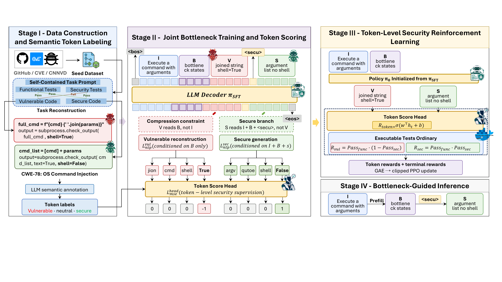

# SecBaRT

Official code release for **SecBaRT**, a bottleneck-based reinforcement
learning framework for secure code generation.  The repository contains the
core training and evaluation pipeline needed to run the method end to end;
baselines are intentionally not included.

SecBaRT learns a task-conditioned *bottleneck* state before decoding.  During
training, the vulnerable and secure implementations of the same task are
reconstructed through an asymmetric attention layout: the vulnerable branch
can only see the task through the bottleneck, and the secure branch cannot copy
the vulnerable code.  A token-level scoring head is trained on the same hidden
states, frozen, and reused during dual-arm RL, where functional and security
tests provide the executable reward.



*Overview: Stage I constructs self-contained tasks and semantic token labels,
Stage II trains the vulnerable reconstruction, secure generation, and the
token scoring head under the bottleneck attention layout, Stage III optimizes
the policy with executable feedback and token-level security rewards, and
Stage IV performs bottleneck-guided inference in a single decoding pass.*

## Pipeline

| Stage | Script | What it does |
|---|---|---|
| I | `scripts/1_sft.sh` | Bottleneck SFT: vulnerable reconstruction + secure generation on the 40,360-triple pool |
| II | `scripts/2_token_head.sh` | Train the token-level scoring head (ordinal objective) on the frozen SFT seed |
| III | `scripts/3_rl_token_reward.sh` | Dual-arm RL from the SFT seed with functional + security execution feedback and the frozen head's token-level security reward |
| IV | `scripts/4_eval_cweval.sh` | Generate on CWEval with the bottleneck server and score with the official harness |
| optional | `scripts/5_eval_functional.sh` | HumanEval+ / MBPP+ with EvalPlus |

Stage III starts from the SFT seed and uses the frozen head to turn the
executable feedback into position-level credit: functional and security tests
score the completed program, while the token-level security reward marks which
generation decisions were responsible for the outcome.  The scoring head is
trained once and is not updated during RL.  CWEval evaluation counts every task
in the denominator: if generation fails, a placeholder file is written so the
task is scored as a failure instead of silently dropping out of the benchmark.

## Quick start

```bash
git clone https://github.com/scgen/SecBaRT && cd SecBaRT

# 1. environment
bash scripts/0_setup.sh

# 2. assets (see DATA.md for download links / reconstruction)
#    hf download scgen/SecBaRT-supervised-fine-tuning train-sft.json --repo-type dataset \
#        --local-dir data/wcstatic_synthref_merge
#    data/wcstatic_synthref_merge/train-sft.json               (40,360 triples)
#    data/wcstatic_synthref_merge/token_labels_v7_ord.jsonl    (token labels)
#    models/Qwen2.5-Coder-7B                                   (base model)
#    third_party/SecCodePLT_Plus/filtered-test_cases.json      (RL tasks)
#    third_party/CWEval/benchmark                              (evaluation)

# 3. train
CUDA_VISIBLE_DEVICES=0 bash scripts/1_sft.sh
CUDA_VISIBLE_DEVICES=0 bash scripts/2_token_head.sh
CUDA_VISIBLE_DEVICES=0 bash scripts/3_rl_token_reward.sh

# 4. evaluate (requires docker with the public co1lin/cweval:latest image)
CUDA_VISIBLE_DEVICES=0 bash scripts/4_eval_cweval.sh
```

All entry scripts read their configuration from environment variables with
repository-relative defaults, so an existing data/model directory can be
plugged in without editing any file:

```bash
MODEL_DIR=/data/models/Qwen2.5-Coder-7B \
SFT_DATA=/data/SecBaRT/train-sft.json \
WORK_DIR=/scratch/secbart bash scripts/1_sft.sh
```

## Repository layout

```
secbart/                 core package (training, RL, token head, vLLM server)
secbart/annotate/        reference implementation of the token-label pipeline
scripts/                 end-to-end entry points
third_party/cweval/      official-harness scoring driver (docker based)
data/samples/            small schema examples for the released data files
DATA.md                  data construction, downloads, and licensing
REPRODUCE.md             step-by-step reproduction notes and expected numbers
```

## Hardware

* Training (SFT and RL) was run on a single 80 GB GPU (A100/H100 class) with
  `--lora_rank 0` (full fine-tuning) and the paged 8-bit optimizer.
* Evaluation serves the 7B model with vLLM at
  `--gpu_memory_utilization 0.9` on one GPU.
* Smaller GPUs can be used with a LoRA rank above zero, but the released
  numbers correspond to the full fine-tuning configuration above.

## Third-party components

The repository depends on, but does not redistribute, CWEval
(<https://github.com/Co1lin/CWEval>, Apache-2.0), SecCodePLT+
(<https://github.com/uiuc-kang-lab/SecCodePLT>), EvalPlus, and the public
vulnerability datasets listed in `DATA.md`.  Their licenses apply to those
assets.
